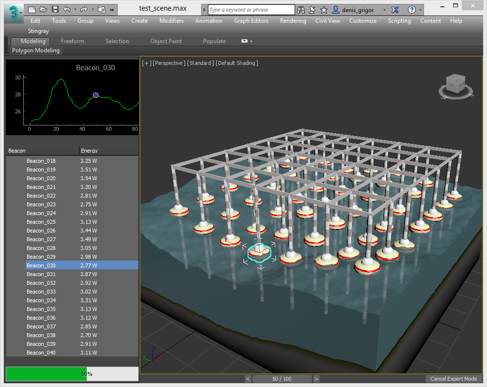

## Green Wave sample
TODO: Describe the context

### Setup:

You can load the provided script directly or make use of included MaxConnector (component of [YCDIVFX_MaxPlus repo](https://github.com/ycdivfx/YCDIVFX_MaxPlus), which is very helpful for using with externals IDEs (like PyCharm). 

#### Example of use with PyCharm:
Load the project into PyCharm:


Select to create a new Run configuration


In new window:

1. create new configuration;
2. in script path put the path to ```MaxConnector\runner.py```
3. in script parameter add ```-f``` and path to the EnergyWatcher script
4. make sure that the Working directory is the same as folder path to ```runner.py```


### Usage:
After running it either directly in 3ds Max or through PyCharm as stated above, you will be presented with a widget that can be docked on a side:

